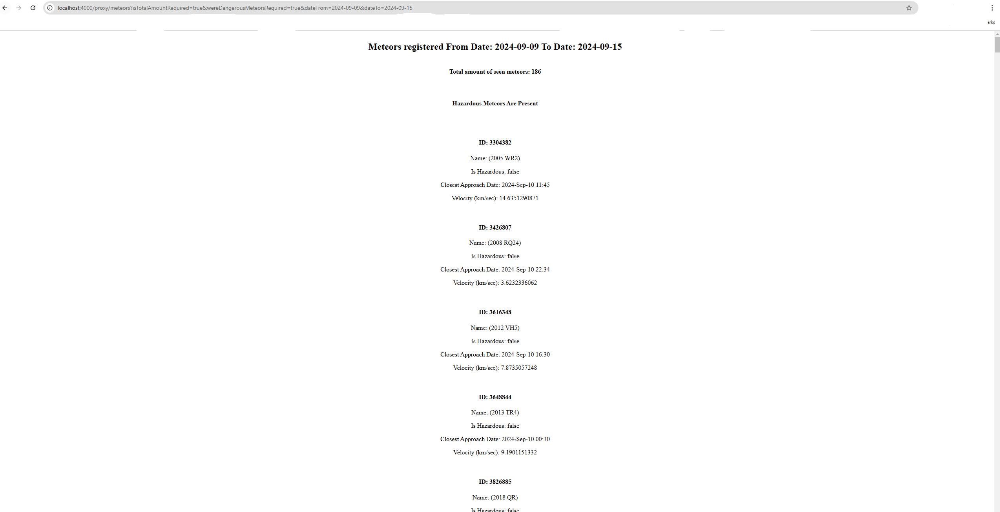
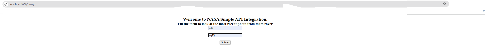
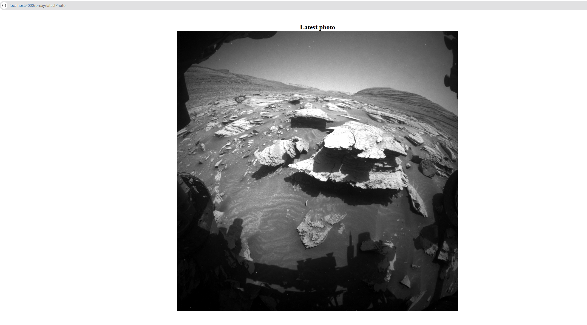

# NASA Open API Integration Example

## Table of Contents
- [Description](#Description)
- [Prerequisites](#Prerequisites)
- [Installation](#Installation)
- [How to](#How to)
- [Usage](#Usage)
- [Contributing](#Contributing)

## Description

Project presents a simple integration with [NASA Open API](https://api.nasa.gov/)
The main goal is to implement simple server utilizing **Node Js, Express, TypeScript**, 
lint tool like **Eslint** and formatter tool like **Prettier**

## Prerequisites

- Recommended Node.js: 20.x or higher
- Recommended NPM: 10.x or higher

## Installation:

- Clone the project:  
  ```git clone  https://github.com/TANKVENERA/Nasa--Proxy--Server.git```

## How to
- Go to the root dir and install node modules:  
  ```npm install```


- Check code with **Eslint**:  
  ```npm run eslint```


- Fix errors manually plus at some cases you can fix errors with running the script:  
  ```npm run eslint:fix```


- Check code with **Prettier**:  
  ```npm run prettier```


- Fix errors with running the script:  
  ```npm run prettier:fix```


- Compile the app:  
  ```npm run build```


- Start app:  
  ```npm run start```

## Usage

1. **GET:** For example, get Meteors that were seen from: 2024-09-09 to: 2024-09-15 , also showing total amount and whether dangerous meteors were amongst others: 
   [Get Meteors](http://localhost:4000/proxy/meteors?isTotalAmountRequired=true&wereDangerousMeteorsRequired=true&dateFrom=2024-09-09&dateTo=2024-09-15)  



2. **POST:** Get the latest rover picture of the Mars surface:  
   - Go to page and fulfil simple form: [Retrieve the Latest Photo](http://localhost:4000/proxy)
     

   - Check the result:
     


     
## Contributing

Thanks to the following contributors:
- [Mikhail1992](https://github.com/Mikhail1992)
